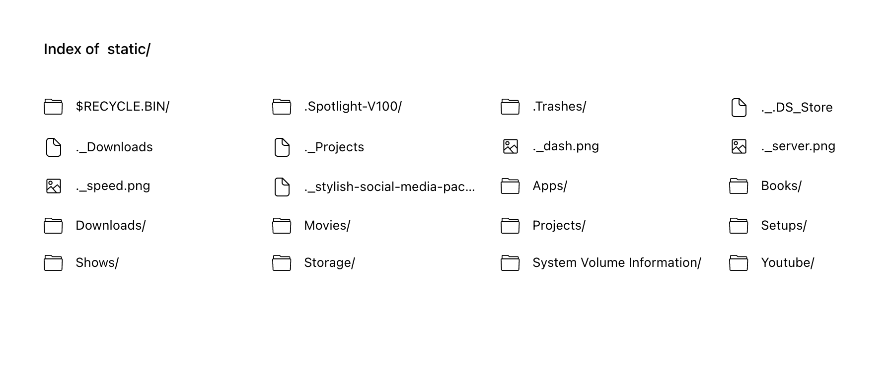

# Docker Serve
A static file server with directory indexing for Docker.


## Why I created this package
I needed a simple way to share files on my local network through `http`.

Do not use this on the internet without running it behind an authentication system.
## How to Use it

### Docker compose

```
version: "3.8"

services:
  serve:
    build: https://github.com/dkyeremeh/serve.git
    image: serve
    ports:
      - 8080:8080
    volumes:
      - /path/to/dir:/var/static
```

## Volumes
`/var/static` Directory to serve
